= JVM Camel Analisys

The objective of this report is compare memory usage by Apache Camel in a simple route, this simple route expose a CRUD
 rest operation with 50 objects persisted in a IMDB in different scenarios.

 * Camel with Spring Boot
 * Camel with Jetty 
 * Vertx (no camel) - I tested with Vertx to compare the memory consumption with a non camel application.

All data was collected with 10 request per second of load.

== Execution flow

. Run the application
. Run the load test 
. Collect the metrics

== Report Summary 

https://docs.google.com/spreadsheets/d/1caaOZi7Fv3PPgredBUVKtDgxsf200mlzJNgFMWpH4NE/edit#gid=0[You could visualize this spread sheet here].

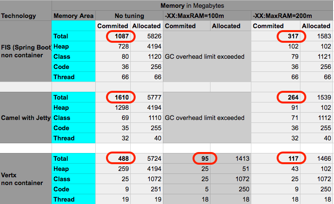

=== Result with no tuning

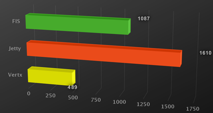

=== Result with MaxRAM=100m

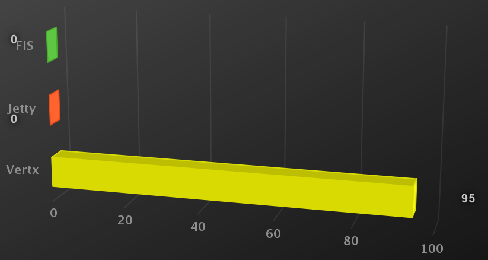

=== Result with MaxRAM=300m

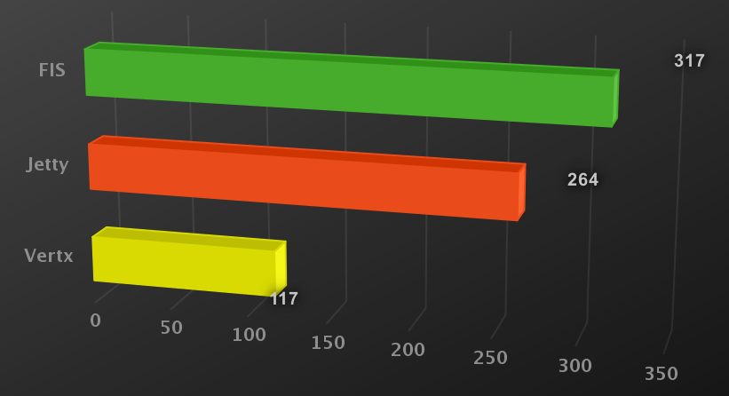

== Hardware spec

The test was did using one Macbook Pro (Retina, 13-inch, Late 2013):

      macOS Sierra (Version 10.12.6)
      Processor 2,8 GHz Intel Core i7
      Memory 16 GB 1600 MHz DDR3

* Java version "1.8.0_131"

* Apache Maven 3.5.0

== Fuse Integration Services (Spring Boot)

Project: link:jvm-analisys/fis-rest[]

=== No tuning

      export MAVEN_OPTS='-XX:NativeMemoryTracking=summary'; mvn spring-boot:run

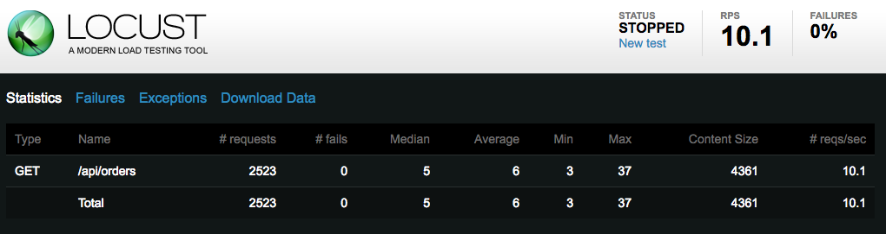

=== Running with MaxRAM=100m

      export MAVEN_OPTS='-XX:NativeMemoryTracking=summary -XX:MaxRAM=100m'; mvn spring-boot:run

=== Running with MaxRAM=200m

      export MAVEN_OPTS='-XX:NativeMemoryTracking=summary -XX:MaxRAM=200m'; mvn spring-boot:run

image::docs/locust-fis-maxram200.png[]

== Camel with Jetty

Project: jvm-analisys/camel-examples/camel-example-restlet-jdbc

load database

      for i in {1..50}
      do
            curl -X POST -d "firstName=test&lastName=person" http://localhost:8080/rs/persons;
      done

=== No tuning

      export MAVEN_OPTS="-XX:NativeMemoryTracking=summary"; mvn jetty:run -Dimpl=java-rest-dsl

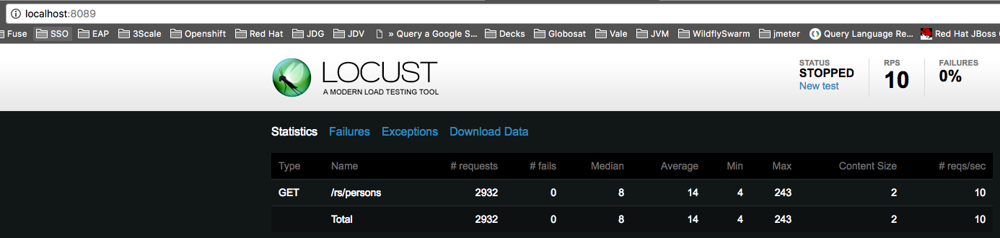

=== Running with MaxRAM=100m

      export MAVEN_OPTS="-XX:NativeMemoryTracking=summary -XX:MaxRAM=100m"; mvn jetty:run -Dimpl=java-rest-dsl

Result: GC overhead limit exceeded.

=== Running with MaxRAM=200m

      export MAVEN_OPTS="-XX:NativeMemoryTracking=summary -XX:MaxRAM=100m"; mvn jetty:run -Dimpl=java-rest-dsl

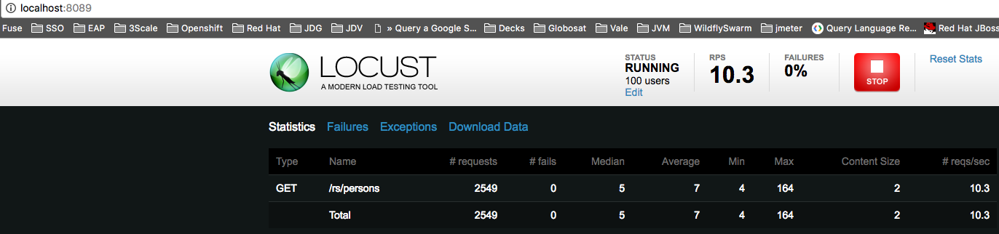

=== Vertx 

The sample used in vertx is the following: 
link:/web-examples/src/main/java/io/vertx/example/web/rest/SimpleREST.java[]

I ran the class direct by the IDE (main method).

=== No tuning

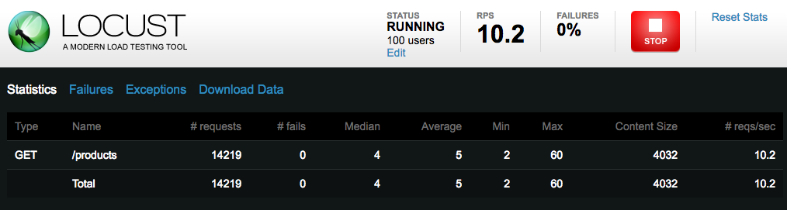

=== Running with MaxRAM=100m

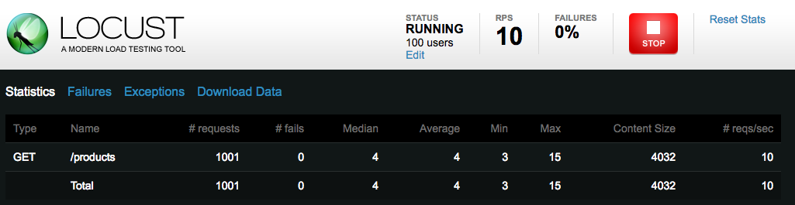

=== Running with MaxRAM=200m

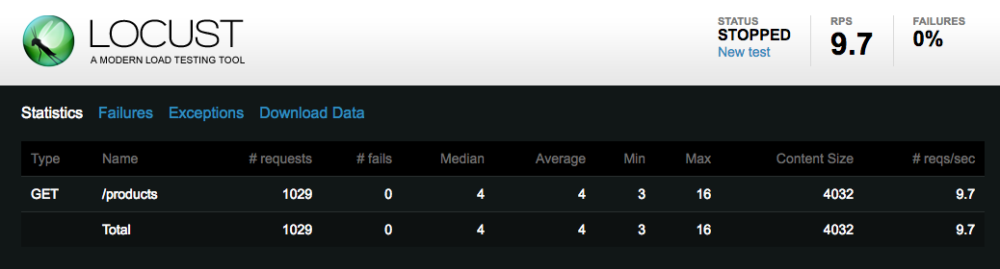

== Load Test

The testing tool used was http://locust.io/[Locust]. All data was collected with a 10 request per second load. 

To run the load test use:

      locust -f <project-path>/load-test.py --host=http://localhost:8080

After that access the web console: http://localhost:8089/

I used 100 users with 1 of hatch rate.

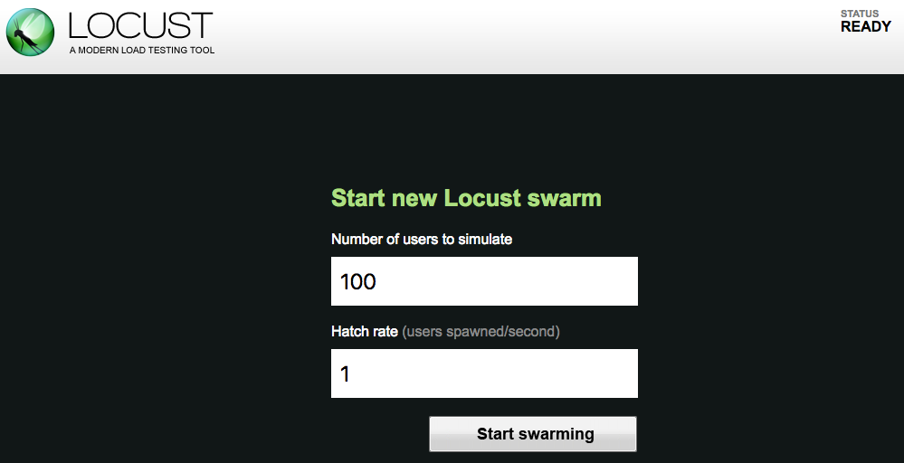

== Collect metrics

The metrics was collected using Java Memory Tracking jdk tool with the option summary. 

To simplify the collect proccess I developed this tool https://github.com/hodrigohamalho/jmt-crawler

