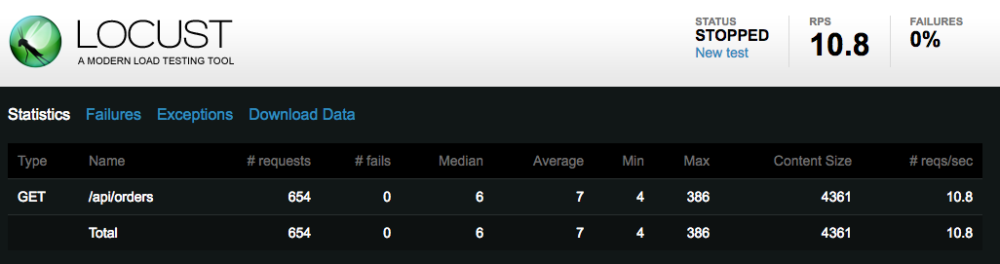

= JVM Camel Analisys

The objective of this report is compare memory usage by Apache Camel in a simple route, this simple route expose a CRUD
 rest operation with 50 objects persisted in a IMDB in different scenarios.

 * Camel with Spring Boot
 * Camel with Jetty 
 * Vertx (no camel) - I tested with Vertx to compare the memory consumption with a non camel application.

== Hardware spec

The test was did using one Macbook Pro (Retina, 13-inch, Late 2013):

      macOS Sierra (Version 10.12.6)
      Processor 2,8 GHz Intel Core i7
      Memory 16 GB 1600 MHz DDR3

* Java version "1.8.0_131"

* Apache Maven 3.5.0

== Load Test

The testing tool used here was http://locust.io/[Locust]. All data was collected with a 10 request per second load. 

To run the load test use:

      locust -f <project-path>/load-test.py --host=http://localhost:8080

After that access the web console: http://localhost:8089/

I used 100 users with 1 of hatch rate.

image::docs/locust-setup.png[]

== Fuse Integration Services (Spring Boot)

Project: jvm-analisys/fis-rest 

=== No tuning

      export MAVEN_OPTS='-XX:NativeMemoryTracking=summary'; mvn spring-boot:run

image::docs/locust-fis-zero-tuning.png[]

=== Running with 100 MB

      export MAVEN_OPTS='-XX:NativeMemoryTracking=summary -XX:MaxRAM=100m'; mvn spring-boot:run

=== Running with 200 MB

      export MAVEN_OPTS='-XX:NativeMemoryTracking=summary -XX:MaxRAM=200m'; mvn spring-boot:run

== Camel with Jetty

Project: jvm-analisys/camel-examples/camel-example-restlet-jdbc

=== No tuning

      export MAVEN_OPTS="-XX:NativeMemoryTracking=summary"; mvn jetty:run -Dimpl=java-rest-dsl

=== Running with 100 MB

      export MAVEN_OPTS="-XX:NativeMemoryTracking=summary -XX:MaxRAM=100m"; mvn jetty:run -Dimpl=java-rest-dsl

Result: GC overhead limit exceeded.

=== Running with 200 MB

      export MAVEN_OPTS="-XX:NativeMemoryTracking=summary -XX:MaxRAM=100m"; mvn jetty:run -Dimpl=java-rest-dsl

image::docs/camel-jetty-maxram200.png[]